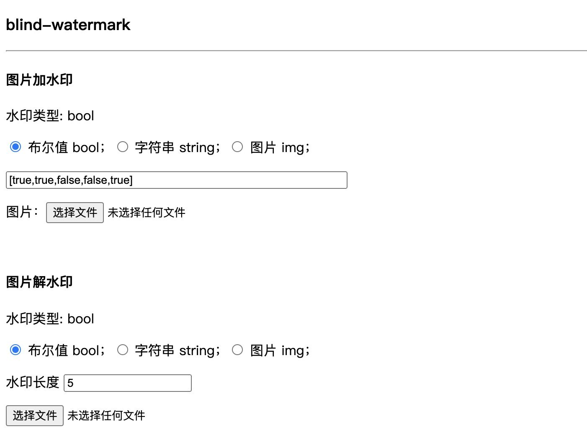

# blind-watermark 例子项目

blindWatermark 是一个用于给图片嵌入数字水印的前端库。解水印 **不需要原图** 。

可嵌入水印类型分别为：布尔值数组、字符串、图片。

水印具有一定的抗攻击能力，比如马赛克、水平裁剪。当前版本垂直剪裁会破坏原图。


## Web Usage
```
git clone git@github.com:Sherryer/blind-watermark.git

cd blind-watermark

npm install

npm run start 
```



## Node Usage

```
git clone git@github.com:Sherryer/blind-watermark.git
cd /watermark.js
node  nodeWm.js
```

